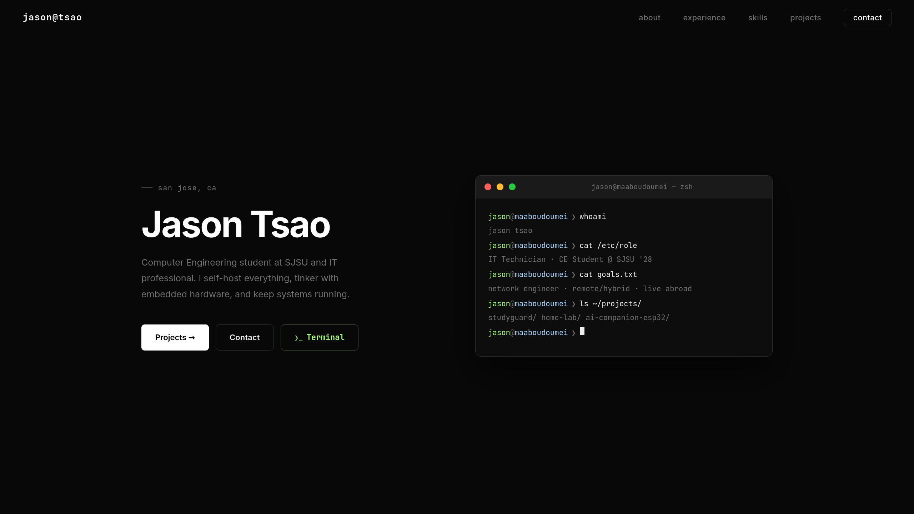

# jason tsao — portfolio



Personal portfolio site built with React. Terminal-themed design with sections for about, experience, skills, certifications, projects, and contact.

## Setup

```bash
npm install
npm start
```

Opens at [http://localhost:3000](http://localhost:3000).

## Build

```bash
npm run build
```

Outputs optimized production bundle to `build/`.

## Stack

- React 19
- CSS (no framework)
- CI/CD Pipeline
- DevOps

## CI/CD

Pushes to `main` trigger the CI/CD pipeline via GitHub Actions (`.github/workflows/deploy.yml`):

1. **Test** — checks out the code, installs dependencies, and runs `npm test` to verify the build.
2. **Deploy** — once tests pass, SSHs into an Oracle server, pulls the latest code, runs `npm install && npm run build`, and restarts the app with PM2.

Required repository secrets:
- `SSH_HOST` — server IP or hostname
- `SSH_USER` — SSH username
- `SSH_PRIVATE_KEY` — private key for authentication
